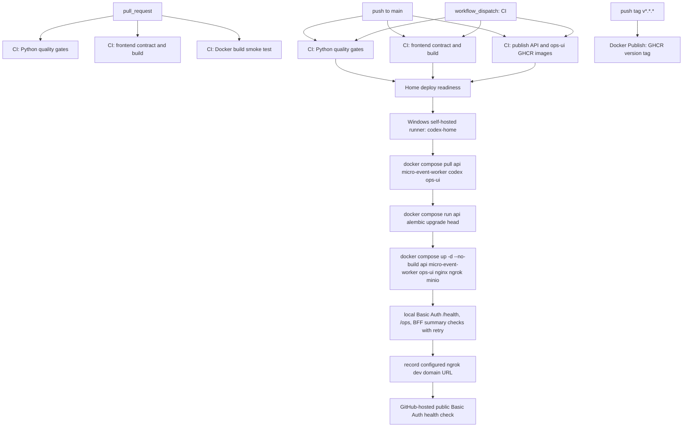
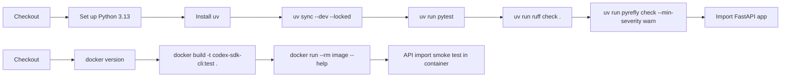
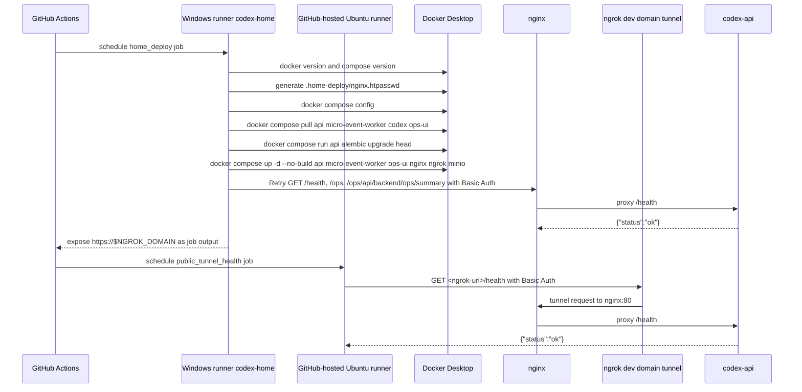
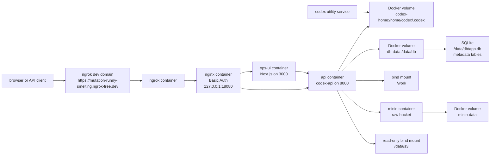
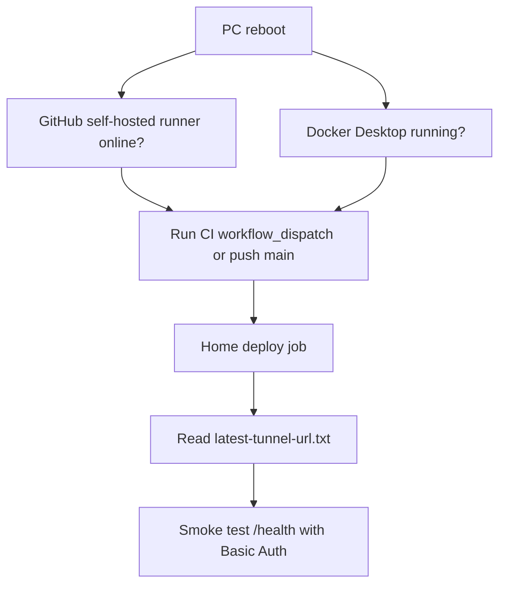

# CI/CD 구성 문서

이 문서는 현재 `main` 기준 GitHub Actions, Docker image publish, Home PC
deployment가 어떻게 연결되어 있는지 설명한다. 실제 source of truth는 다음
파일이다.

- `.github/workflows/ci.yml`: PR/main/manual CI와 Home PC deploy.
- `.github/workflows/docker-publish.yml`: GHCR image publish.
- `compose.home.yaml`: Home PC Docker Compose stack.
- `deploy/nginx/home.conf`: Nginx reverse proxy와 Basic Auth 설정.
- `docs/HOME_PC_DEPLOYMENT.md`: Home PC 배포 운영 절차.
- `docs/HOME_DEPLOYMENT_FLOW.md`: GHCR pull 기반 Home deploy 변경점과 현재 실행 순서.

## 전체 흐름



현재 자동 배포 대상은 AWS EC2가 아니라 Windows Home PC다. AWS Terraform/EC2
문서는 남아 있지만 `main` push 자동 배포에는 참여하지 않는다.

문서-only 변경은 자동 workflow를 시작하지 않는다. `CI`와 `Docker Publish`는
`**/*.md`, `docs/**`, `vaults/**`만 바뀐 `push`/`pull_request`를 무시한다.
필요하면 `workflow_dispatch`로 수동 실행할 수 있다.

## Workflow별 역할

| Workflow | Trigger | Runner | 역할 |
| --- | --- | --- | --- |
| `CI` | `pull_request` | GitHub-hosted Ubuntu | 테스트, Ruff, Pyrefly, OpenAPI export, ops-ui lint/typecheck/test/build, Docker build smoke test. Home deploy는 실행하지 않는다. |
| `CI` | `push` to `main` | GitHub-hosted Ubuntu + Windows self-hosted | 품질 검증, GHCR image publish, Home PC deploy를 실행한다. |
| `CI` | `workflow_dispatch` | GitHub-hosted Ubuntu + Windows self-hosted | 수동으로 같은 CI/deploy 흐름을 실행한다. |
| `Docker Publish` | `push` tag `v*.*.*` | GitHub-hosted Ubuntu | GHCR에 version tag까지 push한다. |

중요한 분리점:

- PR에서는 self-hosted runner를 사용하지 않는다.
- Home deploy는 CI가 publish한 GHCR immutable image를 pull하고, self-hosted runner에서 local image를 다시 build하지 않는다.
- Docker Publish workflow는 version tag release image를 위한 별도 workflow다.

## CI job 상세



`quality`, `frontend`, `publish_images` job이 모두 성공해야 Home PC deploy preflight가 실행된다.

## Home PC deploy 흐름



Home deploy job의 주요 단계:

1. checkout 전에 legacy `data/app.db`가 있으면 runner temp로 백업한다.
2. Docker와 Docker Compose가 동작하는지 확인한다.
3. GitHub secrets의 `HOME_BASIC_AUTH_USER`, `HOME_BASIC_AUTH_PASSWORD`로
   `.home-deploy/nginx.htpasswd`를 생성한다.
4. `docker compose --project-name codex-sdk-home -f compose.home.yaml config`로
   stack 설정을 검증한다.
5. `db-data` volume이 비어 있으면 legacy DB 백업을 `/data/db/app.db`로 옮긴다.
6. `api`, `micro-event-worker`, `codex`, `ops-ui` image를 GHCR에서 pull하고 같은 compose env로 `alembic upgrade head`를 실행한다.
7. `api`, `micro-event-worker`, `ops-ui`, `nginx`, `ngrok`, `minio`를 `up -d --no-build --remove-orphans`로 배포한다.
8. 로컬 Nginx `/health`, `/ops`, `/ops/api/backend/ops/summary`를 Basic Auth로 확인한다.
9. `NGROK_DOMAIN`으로 만든 `https://<domain>` URL을
   `.home-deploy/latest-tunnel-url.txt`와 Actions summary에 기록한다.
10. 별도 GitHub-hosted runner job이 public ngrok URL의 `/health`, `/ops`,
    `/ops/api/backend/ops/summary`를 Basic Auth로 확인한다.

## Runtime stack



서비스 역할:

- `api`: FastAPI app인 `codex-api`를 실행한다. Docker network 내부에서만
  `8000`을 expose한다.
- `micro-event-worker`: 같은 API image에서 `codex-micro-event-worker`를
  실행해 pending `micro_event_extract` video task를 DB polling으로 처리한다.
- `ops-ui`: Next.js 운영 콘솔을 실행한다. `/ops` 아래에 mount되며 BFF가
  `CODEX_OPS_BACKEND_BASE_URL`로 FastAPI를 호출한다.
- `nginx`: 모든 endpoint에 Basic Auth를 적용하고 `/ops`는 `ops-ui:3000`,
  API route는 `api:8000`으로 proxy한다.
  호스트에는 `127.0.0.1:${HOME_NGINX_PORT:-18080}`만 연다.
- `ngrok`: configured dev domain tunnel을 열고 `nginx:80`으로 라우팅한다.
- `minio`: YouTube transcript와 외부 API raw response JSON을 내부 Docker
  network의 S3-compatible object storage에 저장한다. 기본 bucket은 `raw`다.
- SQLite: `youtube_transcripts`, `external_api_calls`, `pipeline_jobs`,
  `pipeline_job_attempts`, `streamers`, `channels` metadata를 저장한다. raw
  JSON은 MinIO에만 둔다.
- `codex`: device-code login과 account 확인을 위한 수동 utility service다.
- `codex-home` volume: `api`와 `codex`가 공유하는 Codex login state를 저장한다.
- `db-data` volume: SQLite application metadata DB를 저장한다.
- `minio-data` volume: MinIO object data를 저장한다.

## Secrets와 variables

필수 GitHub repository secrets:

- `HOME_BASIC_AUTH_USER`
- `HOME_BASIC_AUTH_PASSWORD`
- `NGROK_AUTHTOKEN`

선택 GitHub repository variables:

- `HOME_NGINX_PORT`: 기본값 `18080`.
- `NGROK_DOMAIN`: ngrok dev domain. 현재 값은
  `mutation-runny-smelting.ngrok-free.dev`.
- `CODEX_CLI_MODEL`: default `gpt-5.5`; allowed values are `gpt-5.5`, `gpt-5.4`, `gpt-5.4-mini`.
- `CODEX_CLI_REASONING_EFFORT`: default `medium`; allowed values are `low`, `medium`, `high`, `xhigh`.
- `CODEX_CLI_SANDBOX`: 기본값 `workspace-write`.
- `CODEX_CLI_APPROVAL`: 기본값 `auto-review`.

선택 proxy 설정:

- `CODEX_CLI_YOUTUBE_HTTP_PROXY`
- `CODEX_CLI_YOUTUBE_HTTPS_PROXY`

선택 YouTube Data API 설정:

- `CODEX_CLI_YOUTUBE_DATA_API_KEY`: official YouTube Data API key.
- `CODEX_CLI_YOUTUBE_DATA_TIMEOUT_SECONDS`: 기본값 `10`.

선택 MinIO 설정:

- `CODEX_CLI_TRANSCRIPT_MINIO_ENDPOINT`: 기본값 `minio:9000`.
- `CODEX_CLI_TRANSCRIPT_MINIO_ACCESS_KEY`: 기본값 `codex`.
- `CODEX_CLI_TRANSCRIPT_MINIO_SECRET_KEY`: 기본값 `codex-transcript-dev-password`.
- `CODEX_CLI_TRANSCRIPT_MINIO_BUCKET`: 기본값 `raw`.
- `CODEX_CLI_TRANSCRIPT_MINIO_PREFIX`: 기본값 `youtube/transcripts`.
- `CODEX_CLI_TRANSCRIPT_MINIO_SECURE`: 기본값 `false`.
- `CODEX_CLI_MICRO_EVENT_EXTRACT_CONCURRENCY_LIMIT`: `micro_event_extract`
  window worker count. Home Compose default is `6`.
- `CODEX_CLI_EXTERNAL_API_CALL_MINIO_PREFIX`: 기본값 `external-api-calls`.

선택 DB 설정:

- `CODEX_CLI_DATABASE_URL`: Home Compose 기본값
  `sqlite+aiosqlite:////data/db/app.db`.
- `CODEX_CLI_DATABASE_ECHO`: 기본값 `false`.

Home deploy는 API container와 같은 DB 설정으로 `alembic upgrade head`를 먼저
실행한 뒤 stack을 recreate한다.

Basic Auth는 Nginx에서 처리한다. 앱 코드에는 인증 middleware가 없다.

## Public ngrok URL

Home deploy는 GitHub variable `NGROK_DOMAIN`에 설정된 고정 ngrok dev domain을
사용한다. 현재 URL은 `https://mutation-runny-smelting.ngrok-free.dev`다.

최신 URL 확인 위치:

```powershell
Get-Content F:\actions-runner\codex-sdk\_work\codex-sdk\codex-sdk\.home-deploy\latest-tunnel-url.txt
```

또는 GitHub Actions의 `CI` run summary에서 `Home ngrok tunnel` 섹션을 본다.

현재 URL이 실제로 살아있는지 확인:

```powershell
$user = "<HOME_BASIC_AUTH_USER>"
$password = "<HOME_BASIC_AUTH_PASSWORD>"
$pair = "${user}:${password}"
$encoded = [Convert]::ToBase64String([Text.Encoding]::UTF8.GetBytes($pair))
$headers = @{ Authorization = "Basic $encoded" }
$url = Get-Content F:\actions-runner\codex-sdk\_work\codex-sdk\codex-sdk\.home-deploy\latest-tunnel-url.txt
Invoke-RestMethod -Uri "$url/health" -Headers $headers
```

## 재부팅 후 배포 절차

재부팅 후에는 runner service와 Docker Desktop 상태가 중요하다.



점검 명령:

```powershell
docker version
docker info
docker compose version
gh run list -R Mabaragi/codex-sdk --branch main --limit 5
gh workflow run CI -R Mabaragi/codex-sdk --ref main
```

Docker Desktop이 떠 있지 않으면 self-hosted runner는 job을 받을 수 있어도
`Show Docker version` 또는 `Prepare home deployment files` 단계에서 실패한다.
`docker info`가 `npipe:////./pipe/dockerDesktopLinuxEngine`에 연결하지 못하면
Docker Desktop을 먼저 실행하고 engine이 준비된 뒤 CI workflow를 다시 실행한다.

## 배포 속도 최적화

main branch 배포는 `CI` workflow에서 immutable GHCR 이미지를 먼저 publish하고,
Home PC runner는 그 이미지를 pull해서 실행한다. Home PC에서 매번 Docker build를
다시 하지 않는다.

구체적인 before/after, 이미지 태그, compose 명령, fallback 절차는
`docs/HOME_DEPLOYMENT_FLOW.md`에 정리한다.

- API image: `ghcr.io/mabaragi/codex-sdk:sha-<short-sha>`
- Ops UI image: `ghcr.io/mabaragi/codex-sdk-ops-ui:sha-<short-sha>`
- `compose.home.yaml`은 일반 배포용 image 기반 compose다.
- `compose.home.build.yaml`은 Home PC에서 수동으로 local build가 필요할 때만 쓴다.
- Home deploy는 `docker compose pull`, pulled API image 기반 Alembic migration,
  `docker compose up -d --no-build --remove-orphans` 순서로 실행한다.
- `Docker Publish` workflow는 main push 중복 publish를 하지 않고 version tag용으로만 유지한다.

## 운영 명령

최근 Actions 확인:

```powershell
gh run list -R Mabaragi/codex-sdk --branch main --limit 10
gh run watch <run-id> -R Mabaragi/codex-sdk --exit-status
```

Home stack 확인:

```powershell
docker compose --project-name codex-sdk-home -f compose.home.yaml ps
docker compose --project-name codex-sdk-home -f compose.home.yaml logs --tail 100 api micro-event-worker ops-ui nginx ngrok minio
```

수동 재배포:

```powershell
gh workflow run CI -R Mabaragi/codex-sdk --ref main
```

Stack restart:

```powershell
docker compose --project-name codex-sdk-home -f compose.home.yaml restart
```

Stack stop:

```powershell
docker compose --project-name codex-sdk-home -f compose.home.yaml down
```

`codex-home` volume은 Codex login state를 담고 있으므로 의도적으로 로그인을
초기화할 때만 삭제한다. `db-data` volume은 SQLite metadata DB를 담으므로
의도적으로 application metadata를 초기화할 때만 삭제한다.

## 흔한 실패와 확인 지점

| 증상 | 볼 곳 | 처리 |
| --- | --- | --- |
| `home_deploy`가 기다림 | GitHub runner 상태 | Windows self-hosted runner service가 online인지 확인한다. |
| `Show Docker version` 또는 `Prepare home deployment files` 실패 | Docker Desktop | `docker info`가 Linux engine에 연결되는지 확인하고, Docker Desktop을 실행한 뒤 workflow를 다시 돌린다. |
| Preflight 실패 | GitHub secrets | `HOME_BASIC_AUTH_USER`, `HOME_BASIC_AUTH_PASSWORD`가 있는지 확인한다. |
| Public health가 실패 | ngrok container logs, `NGROK_DOMAIN` | `NGROK_AUTHTOKEN`/`NGROK_DOMAIN` 설정과 ngrok dashboard endpoint 상태를 확인한다. |
| Self-hosted runner DNS만 실패 | `public_tunnel_health` job | Windows runner 내부 DNS 상태와 분리하기 위해 public health는 GitHub-hosted runner에서 확인한다. |
| Local `/ops` health가 `NullReferenceException` | Windows PowerShell 5.1 `Invoke-WebRequest` | Next HTML parser 문제일 수 있다. workflow처럼 `-UseBasicParsing`을 붙이고 `/ops/api/backend/ops/summary` JSON marker를 별도로 확인한다. |
| Browser에서 Basic Auth가 계속 실패 | browser auth cache | 다른 창, incognito, 또는 credential cache 삭제 후 다시 로그인한다. |
| `/codex/runs` 인증 실패 | `codex-home` volume | `codex` utility service로 device-code login 상태를 확인한다. |
