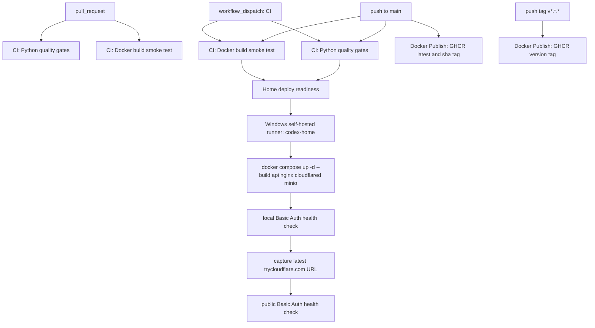
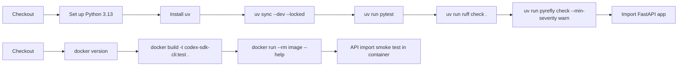
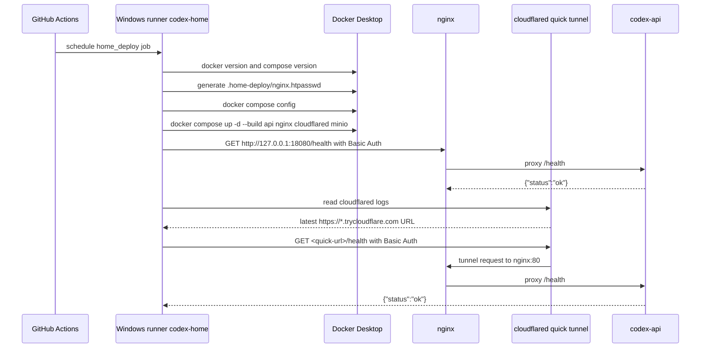
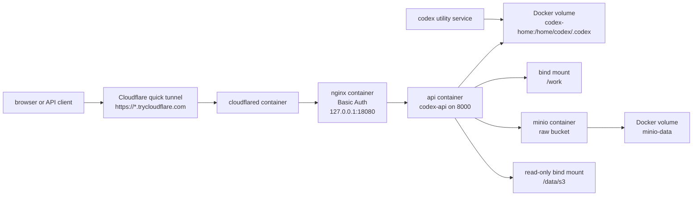
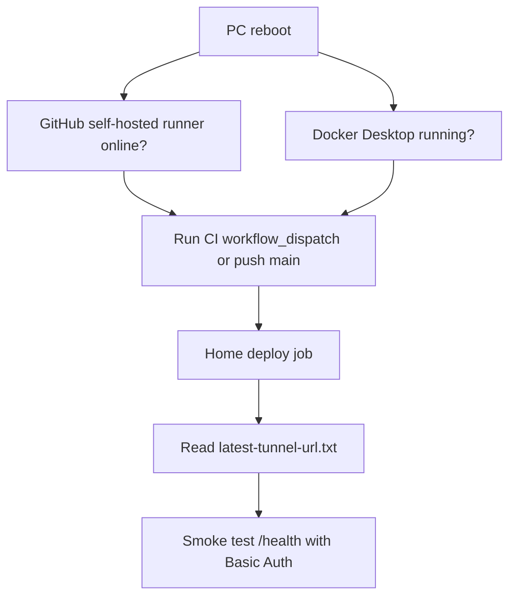

# CI/CD 구성 문서

이 문서는 현재 `main` 기준 GitHub Actions, Docker image publish, Home PC
deployment가 어떻게 연결되어 있는지 설명한다. 실제 source of truth는 다음
파일이다.

- `.github/workflows/ci.yml`: PR/main/manual CI와 Home PC deploy.
- `.github/workflows/docker-publish.yml`: GHCR image publish.
- `compose.home.yaml`: Home PC Docker Compose stack.
- `deploy/nginx/home.conf`: Nginx reverse proxy와 Basic Auth 설정.
- `docs/HOME_PC_DEPLOYMENT.md`: Home PC 배포 운영 절차.

## 전체 흐름



현재 자동 배포 대상은 AWS EC2가 아니라 Windows Home PC다. AWS Terraform/EC2
문서는 남아 있지만 `main` push 자동 배포에는 참여하지 않는다.

문서-only 변경은 자동 workflow를 시작하지 않는다. `CI`와 `Docker Publish`는
`**/*.md`, `docs/**`, `vaults/**`만 바뀐 `push`/`pull_request`를 무시한다.
필요하면 `workflow_dispatch`로 수동 실행할 수 있다.

## Workflow별 역할

| Workflow | Trigger | Runner | 역할 |
| --- | --- | --- | --- |
| `CI` | `pull_request` | GitHub-hosted Ubuntu | 테스트, Ruff, Pyrefly, Docker build smoke test. Home deploy는 실행하지 않는다. |
| `CI` | `push` to `main` | GitHub-hosted Ubuntu + Windows self-hosted | 품질 검증 후 Home PC에 API를 배포한다. |
| `CI` | `workflow_dispatch` | GitHub-hosted Ubuntu + Windows self-hosted | 수동으로 같은 CI/deploy 흐름을 실행한다. |
| `Docker Publish` | `push` to `main` | GitHub-hosted Ubuntu | GHCR에 `latest`와 `sha-<commit>` image를 push한다. |
| `Docker Publish` | `push` tag `v*.*.*` | GitHub-hosted Ubuntu | GHCR에 version tag까지 push한다. |

중요한 분리점:

- PR에서는 self-hosted runner를 사용하지 않는다.
- Home deploy는 GHCR image를 pull하지 않고, self-hosted runner checkout에서
  `compose.home.yaml`로 local image `codex-sdk-cli:home`을 다시 build한다.
- GHCR publish는 배포 산출물 보관과 외부 재사용을 위한 별도 workflow다.

## CI job 상세



`quality`와 `docker` job이 모두 성공해야 Home PC deploy preflight가 실행된다.

## Home PC deploy 흐름



Home deploy job의 주요 단계:

1. Docker와 Docker Compose가 동작하는지 확인한다.
2. GitHub secrets의 `HOME_BASIC_AUTH_USER`, `HOME_BASIC_AUTH_PASSWORD`로
   `.home-deploy/nginx.htpasswd`를 생성한다.
3. `docker compose --project-name codex-sdk-home -f compose.home.yaml config`로
   stack 설정을 검증한다.
4. `api`, `nginx`, `cloudflared`를 `up -d --build`로 배포한다.
5. 로컬 Nginx health check를 Basic Auth로 확인한다.
6. `cloudflared` 로그에서 가장 마지막 `https://*.trycloudflare.com` URL을
   찾아 `.home-deploy/latest-tunnel-url.txt`와 Actions summary에 기록한다.
7. public quick tunnel URL의 `/health`도 Basic Auth로 확인한다.

가장 마지막 URL을 사용하는 이유는 `cloudflared` 컨테이너 로그에 이전 quick
tunnel URL이 남아 있을 수 있기 때문이다. 재부팅 직후 첫 배포 실패는 이 로그의
첫 번째 URL을 잡아서 이미 죽은 tunnel을 확인한 것이 원인이었다.

## Runtime stack



서비스 역할:

- `api`: FastAPI app인 `codex-api`를 실행한다. Docker network 내부에서만
  `8000`을 expose한다.
- `nginx`: 모든 endpoint에 Basic Auth를 적용하고 `api:8000`으로 proxy한다.
  호스트에는 `127.0.0.1:${HOME_NGINX_PORT:-18080}`만 연다.
- `cloudflared`: account-less quick tunnel을 열고 `nginx:80`으로 라우팅한다.
- `minio`: YouTube transcript endpoint가 반환하는 JSON을 내부 Docker network의
  S3-compatible object storage에 저장한다. 기본 bucket은 `raw`다.
- `codex`: device-code login과 account 확인을 위한 수동 utility service다.
- `codex-home` volume: `api`와 `codex`가 공유하는 Codex login state를 저장한다.
- `minio-data` volume: MinIO object data를 저장한다.

## Secrets와 variables

필수 GitHub repository secrets:

- `HOME_BASIC_AUTH_USER`
- `HOME_BASIC_AUTH_PASSWORD`

선택 GitHub repository variables:

- `HOME_NGINX_PORT`: 기본값 `18080`.
- `CODEX_CLI_MODEL`
- `CODEX_CLI_SANDBOX`: 기본값 `workspace-write`.
- `CODEX_CLI_APPROVAL`: 기본값 `auto-review`.

선택 proxy 설정:

- `CODEX_CLI_YOUTUBE_HTTP_PROXY`
- `CODEX_CLI_YOUTUBE_HTTPS_PROXY`

선택 MinIO 설정:

- `CODEX_CLI_TRANSCRIPT_MINIO_ENDPOINT`: 기본값 `minio:9000`.
- `CODEX_CLI_TRANSCRIPT_MINIO_ACCESS_KEY`: 기본값 `codex`.
- `CODEX_CLI_TRANSCRIPT_MINIO_SECRET_KEY`: 기본값 `codex-transcript-dev-password`.
- `CODEX_CLI_TRANSCRIPT_MINIO_BUCKET`: 기본값 `raw`.
- `CODEX_CLI_TRANSCRIPT_MINIO_PREFIX`: 기본값 `youtube/transcripts`.
- `CODEX_CLI_TRANSCRIPT_MINIO_SECURE`: 기본값 `false`.

Basic Auth는 Nginx에서 처리한다. 앱 코드에는 인증 middleware가 없다.

## Quick tunnel URL

Quick tunnel URL은 고정 도메인이 아니다. `cloudflared`가 새로 시작되거나
컨테이너가 재생성되면 바뀔 수 있다.

최신 URL 확인 위치:

```powershell
Get-Content F:\actions-runner\codex-sdk\_work\codex-sdk\codex-sdk\.home-deploy\latest-tunnel-url.txt
```

또는 GitHub Actions의 `CI` run summary에서 `Home quick tunnel` 섹션을 본다.

현재 URL이 실제로 살아있는지 확인:

```powershell
$user = "<HOME_BASIC_AUTH_USER>"
$password = "<HOME_BASIC_AUTH_PASSWORD>"
$pair = "${user}:${password}"
$encoded = [Convert]::ToBase64String([Text.Encoding]::UTF8.GetBytes($pair))
$headers = @{ Authorization = "Basic $encoded" }
$url = Get-Content F:\actions-runner\codex-sdk\_work\codex-sdk\codex-sdk\.home-deploy\latest-tunnel-url.txt
Invoke-RestMethod -Uri "$url/health" -Headers $headers
```

## 재부팅 후 배포 절차

재부팅 후에는 runner service와 Docker Desktop 상태가 중요하다.



점검 명령:

```powershell
docker version
docker compose version
gh run list -R Mabaragi/codex-sdk --branch main --limit 5
gh workflow run CI -R Mabaragi/codex-sdk --ref main
```

Docker Desktop이 떠 있지 않으면 self-hosted runner는 job을 받을 수 있어도
`Show Docker version` 단계에서 실패한다. 이 경우 Docker Desktop을 먼저 실행하고
CI workflow를 다시 실행한다.

## 운영 명령

최근 Actions 확인:

```powershell
gh run list -R Mabaragi/codex-sdk --branch main --limit 10
gh run watch <run-id> -R Mabaragi/codex-sdk --exit-status
```

Home stack 확인:

```powershell
docker compose --project-name codex-sdk-home -f compose.home.yaml ps
docker compose --project-name codex-sdk-home -f compose.home.yaml logs --tail 100 api nginx cloudflared minio
```

수동 재배포:

```powershell
gh workflow run CI -R Mabaragi/codex-sdk --ref main
```

Stack restart:

```powershell
docker compose --project-name codex-sdk-home -f compose.home.yaml restart
```

Stack stop:

```powershell
docker compose --project-name codex-sdk-home -f compose.home.yaml down
```

`codex-home` volume은 Codex login state를 담고 있으므로 의도적으로 로그인을
초기화할 때만 삭제한다.

## 흔한 실패와 확인 지점

| 증상 | 볼 곳 | 처리 |
| --- | --- | --- |
| `home_deploy`가 기다림 | GitHub runner 상태 | Windows self-hosted runner service가 online인지 확인한다. |
| `Show Docker version` 실패 | Docker Desktop | Docker Desktop을 실행한 뒤 workflow를 다시 돌린다. |
| Preflight 실패 | GitHub secrets | `HOME_BASIC_AUTH_USER`, `HOME_BASIC_AUTH_PASSWORD`가 있는지 확인한다. |
| Public health가 530/1033 | quick tunnel URL, cloudflared logs | 최신 URL을 확인한다. workflow는 마지막 URL을 선택하도록 되어 있다. |
| Browser에서 Basic Auth가 계속 실패 | browser auth cache | 다른 창, incognito, 또는 credential cache 삭제 후 다시 로그인한다. |
| `/codex/runs` 인증 실패 | `codex-home` volume | `codex` utility service로 device-code login 상태를 확인한다. |
