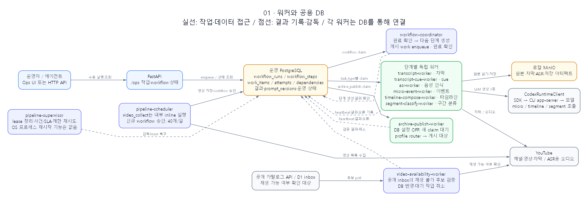
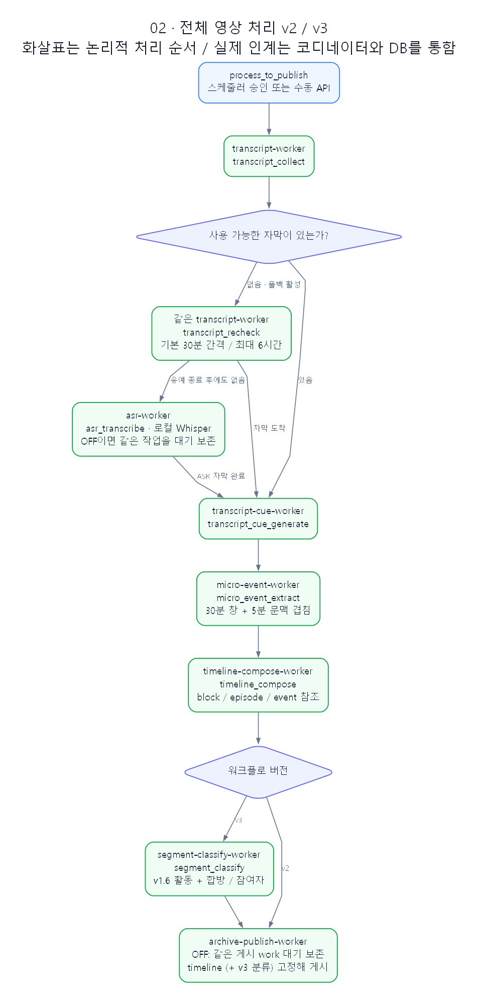
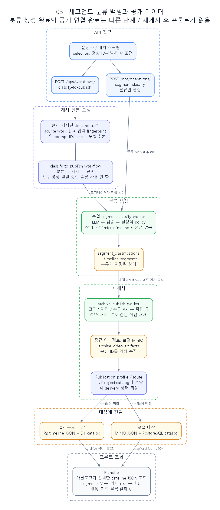
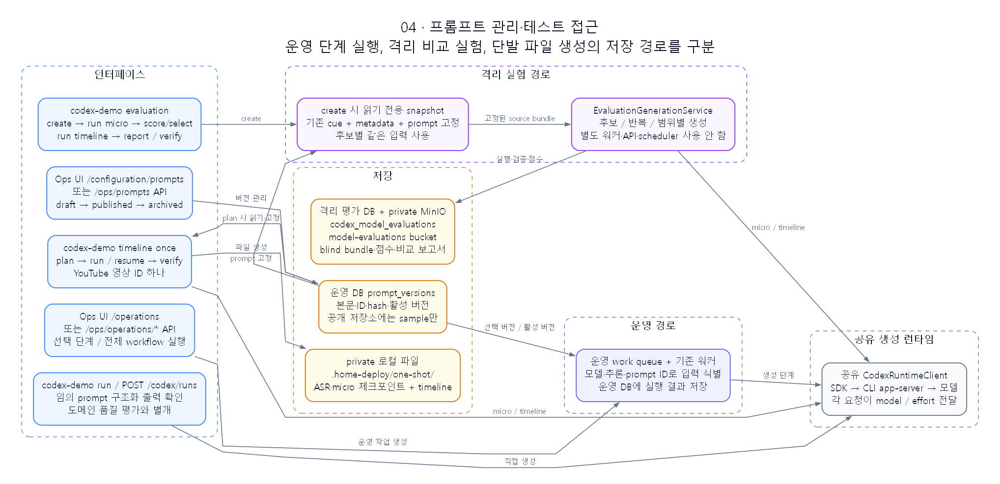

# 파이프라인 워커와 테스트·백필 접근

2026-09-30 현재 작업 트리의 구현 기준. Planetip의 분류 UI는 로컬 구현을 포함하며,
운영 웹사이트 배포 완료 여부를 이 그림이 나타내지는 않는다.

## 1. 워커와 공용 DB



[확대 가능한 SVG](images/pipeline-workers/01-runtime.svg)

워커 사이의 연결은 운영 PostgreSQL을 통한다. API와 스케줄러가 작업을 저장하고,
각 워커는 자신이 처리할 `task_type`의 작업을 claim한다. 코디네이터는 단계 결과를
확인하고 다음 작업을 생성한다. 큐는 `work_items` 테이블이며 별도 Redis·Celery
메시지 브로커를 사용하지 않는다.

| 프로세스 | 역할 / 가져오는 작업 | 주요 접근 대상 |
| --- | --- | --- |
| `api` | 수동 작업·workflow 요청, 설정·프롬프트·상태 조회 | 운영 DB, 필요 시 inline 실행기 |
| `pipeline-scheduler` | 채널 영상 수집, 신규 전체 처리 workflow 승인 | YouTube, 운영 DB, 게시된 프롬프트 |
| `workflow-coordinator` | workflow claim, 결과 확인, 다음 단계 생성 | workflow·work 테이블, 저장된 결과 |
| `archive-publish-worker` | 게시 work claim, 전달 체크포인트 재사용, 게시 결과 저장 | DB 게시 설정, 아티팩트·게시 대상 |
| `transcript-worker` | `transcript_collect`; 재확인도 같은 워커 | YouTube 자막, MinIO, 운영 DB |
| `transcript-cue-worker` | `transcript_cue_generate` | 저장된 자막 → cue, 운영 DB |
| `asr-worker` | `asr_transcribe` | 오디오 다운로드, 로컬 Faster Whisper, ASR 청크 체크포인트 |
| `micro-event-worker` | `micro_event_extract` | cue·문맥·프롬프트 → Codex → 이벤트·창 체크포인트 |
| `timeline-compose-worker` | `timeline_compose` | 이벤트·프롬프트 → Codex → block·episode·이벤트 참조 |
| `segment-classify-worker` | `segment_classify` | timeline·영상 metadata·지식·프롬프트 → Codex → 구간 분류 |
| `pipeline-supervisor` | lease 만료 복구, queue/SLA 사건, 허용된 자동 재시도 | 운영 상태·work·workflow·사건 테이블 |
| `video-availability-worker` | 공개 inbox 후보의 YouTube 재생 가능 여부 검증 | 공개 카탈로그 API/D1 inbox, YouTube, 운영 DB |

`video_collect`는 스케줄러 안에서 inline으로 실행된다. `archive_publish`는 전체 처리,
분류 백필, 수동 게시 API 모두 공용 게시 큐에 들어가고 독립 게시 워커가 실행한다.

### 실행 단위와 복구

- `workflow_runs` / `workflow_steps`: 영상 전체의 단계 순서와 대기 상태.
- `work_items` / `work_item_dependencies`: 각 단계의 입력 식별자, 상태와 의존성.
- `work_attempts`: 재시도별 실행 기록, 결과와 오류.
- 공용 `WorkExecutionEngine`: claim → attempt → heartbeat → 실행 → 성공/실패 기록.
  기본 lease 90초, heartbeat 30초이며 장시간 생성 중에도 lease를 갱신한다.
- 워커별 슬롯 수와 한 영상 내부 병렬성은 다르다. 현재 설정은 micro 영상 1개,
  해당 영상의 창 최대 6개; timeline 3개; segment 2개; 게시 1개 동시 실행이다.
- supervisor는 DB상의 작업·사건을 복구한다. 종료된 OS 프로세스를 직접 재실행하는
  프로세스 관리자는 아니다.
- 운영 프로세스는 별도 Windows Terminal에서 `runtime.ps1`로 시작한다.
  `active → draining → stopped` 전환은 새 enqueue·claim을 막고 실행 완료를 기다린다.
  [시작·안전 종료 절차](LOCAL_NATIVE_DEPLOYMENT.md)를 따른다.

게시 단계는 독립 `archive-publish-worker`가 실행한다. 코디네이터는 게시 작업을
enqueue하고 완료 상태를 확인한다. DB 게시 설정이 OFF이면 게시 work는 pending으로
보존되고 LLM 처리는 계속된다. ON 전환은 같은 작업과 체크포인트를 재개한다.
Ops UI Command Center·게시 화면 또는 `/ops/automation/publishing` API로 제어한다.

## 2. 전체 영상 처리 v2 / v3



[확대 가능한 SVG](images/pipeline-workers/02-workflow.svg)

그림의 화살표는 결과 데이터의 처리 순서다. 각 단계가 다음 워커를 직접 호출하는
방식으로 구현돼 있지는 않다. 코디네이터가 완료 결과를 확인해 다음 `work_item`을
만들거나 기존 동일 입력 작업을 재사용한다.

| 경로 | 단계 |
| --- | --- |
| 자막 있음 | 자막 수집 → cue → micro → timeline → 게시 |
| 자막 없음·폴백 활성 | 자막 재확인 → 유예 후 ASR → cue → downstream |
| `v2` | timeline 이후 바로 게시 |
| `v3` | timeline 이후 segment 분류를 완료한 뒤 게시 |
| `classify_to_publish` | 현재 게시 원본을 고정 → segment 분류 → 재게시 |

자동 전체 처리의 기본 자막 유예는 6시간, 재확인 간격은 30분이다. ASR 워커 설정이
OFF이면 ASR 작업은 같은 ID와 체크포인트를 유지하며 대기한다. 다시 켜고 안전하게
재시작하면 처리한다. 폴백 자체가 `disabled`인 수동 요청은 이 경로와 별도다.

스케줄러의 하루 40개 한도는 서울 시간 기준 **자동 전체 처리의 신규 승인 수**다.
한 tick에서는 최대 12개를 승인하며 가능한 경우 채널당 먼저 2개씩 배분한다.
`v2`와 `v3`를 함께 집계·중복 검사한다. 완료 수, 기존 작업 재시도·재개, 분류 전용
백필의 수와는 다르다. 과거 영상을 처음부터 전체 처리하는 자동 백필은 이 한도를
공유하고 수동 API 실행은 자동 승인 집계에 추가되지 않는다.

새 일반 처리와 다음 단계로 진행 가능한 일반 처리는 분류 전용 백필보다 먼저 claim한다.
일반 처리의 워커 결과를 기다리는 동안에는 백필도 계속 진행할 수 있다.

## 3. 세그먼트 분류 백필과 공개 연결



[확대 가능한 SVG](images/pipeline-workers/03-backfill-publish.svg)

| 접근 | 생성되는 작업 | 게시 여부 |
| --- | --- | --- |
| `POST /ops/operations/segment-classify` | 분류 work만 enqueue | 이 요청만으로 재게시하지 않음 |
| `POST /ops/workflows/classify-to-publish` | 분류 → 게시 workflow | 분류 완료 후 게시 워커가 실행 |
| `POST /ops/workflows/process-to-publish`, `segmentEnabled: true` | `v3` 전체 처리 | upstream 처리와 분류 후 게시 |
| `POST /ops/operations/archive-publish` | 게시 worker work (`202`) | 호환 분류 자동 포함 또는 `includeSegments`로 제어 |

백필 API는 `selection`으로 영상 ID·채널·조건·개수를 받는다. 운영자나 배치 스크립트가
같은 API를 호출한다. 전용 백필 CLI나 Ops UI 버튼은 현재 없다.

백필은 environment·variant·schema에 맞는 **현재 게시된 timeline**을 선택한다.
미게시 실험 결과를 대신 가져오지 않는다. source timeline work ID, 입력 fingerprint,
프롬프트 ID/hash, 모델·추론, taxonomy·policy를 고정한다. 같은 입력이면 작업을
재사용하며 source나 생성 설정이 바뀌면 다른 작업 identity가 된다.

분류에는 원문 자막 대신 영상 metadata와 timeline block·episode 제목·요약·시간,
streamer 지식을 사용한다. Codex 출력 검증과 결정적 후처리를 거쳐
`segment_classifications`와 `timeline_segments`에 저장한다. 분류만 저장한 상태는
프론트 연결 완료 상태가 아니다.

게시 단계는 timeline과 classification의 source·fingerprint가 맞는지 검증하고 공개
JSON에 `taxonomyVersion`, `segments`, `segmentClassification`을 포함한다. 정규
아티팩트를 로컬 MinIO에 저장한 뒤 streamer별 publication profile의 object/catalog
destination에 전달한다. 각 delivery와 publication의 상태를 별도로 기록한다.

| 게시 대상 | 타임라인 JSON | 조회 카탈로그 |
| --- | --- | --- |
| 클라우드 route | R2 | D1 / archive API |
| 로컬 route | MinIO | 로컬 PostgreSQL / `/api/archive` |

Planetip은 카탈로그에서 선택된 타임라인 JSON을 읽는다. 로컬 프론트 구현은 `segments`가
있으면 카테고리 구간·필터, 없으면 기존 블록·필터를 표시한다. 개발 미리보기는 DEV에서
게시 분류가 없을 때만 사용한다. 운영 프론트에 반영하려면 해당 UI 코드 배포도 필요하다.

새 `v3` 처리나 분류 백필에서 분류가 실패하면 해당 workflow의 새 게시도 완료되지 않는다.
분류가 없는 기존 게시 데이터와 그 UI는 계속 유지된다.

## 4. 프롬프트 관리와 테스트 인터페이스



[확대 가능한 SVG](images/pipeline-workers/04-prompt-testing.svg)

| 인터페이스 | 하는 일 | 저장·실행 경로 |
| --- | --- | --- |
| Ops UI `/configuration/prompts` 또는 `/ops/prompts/*` | draft 생성·버전 조회·활성화·archive | 운영 DB의 프롬프트 버전 관리 |
| Ops UI `/operations` 또는 `/ops/operations/*` | 특정 단계 또는 전체 영상 처리 실행 | 운영 work queue와 기존 워커 |
| `codex-demo evaluation` | 같은 cue·범위·프롬프트 snapshot으로 모델·추론·프롬프트 후보 비교 | 별도 평가 DB와 private MinIO; 운영 워커 사용 안 함 |
| `codex-demo timeline once` | YouTube 영상 하나를 단발 처리, 체크포인트 재개 | private 로컬 파일; 운영 결과 DB·게시 경로에 쓰지 않음 |
| `codex-demo run` 또는 `POST /codex/runs` | 임의 프롬프트 응답·구조화 출력 스모크 테스트 | Codex runtime 직접 호출 |

### 같은 프롬프트로 비교하기

운영 생성도 테스트 생성도 `CodexRuntimeClient`를 사용하지만 입력·저장·실행 흐름은
인터페이스마다 다르다. 같은 SDK를 쓴다는 사실만으로 프롬프트 전체가 같아지지는 않는다.

`evaluation create`에서 기존 운영 cue·영상 문맥을 읽기 전용으로 snapshot하고,
후보의 `promptVersionId` 또는 당시 활성 버전을 본문·hash와 함께 고정한다.
이후 실행은 해당 snapshot을 사용한다. micro 결과를 블라인드 평가·선택한 다음
timeline 후보에 같은 선택 결과를 공급한다. 영상과 시간 범위, 프롬프트 버전, 창 크기,
겹침, 모델·추론·반복 설정을 명시해 비교한다.

```powershell
uv run codex-demo evaluation create --plan <private-plan.json>
uv run codex-demo evaluation run --experiment-id <id> --stage micro
uv run codex-demo evaluation bundle --experiment-id <id> --stage micro
uv run codex-demo evaluation score import --experiment-id <id> --file <private-scores.json>
uv run codex-demo evaluation select-micro --experiment-id <id> --file <private-selections.json>
uv run codex-demo evaluation run --experiment-id <id> --stage timeline
uv run codex-demo evaluation report --experiment-id <id> --format md
```

`evaluation`의 정식 비교 stage는 현재 micro와 timeline이다. segment 분류 비교가 이 CLI에
연결돼 있지는 않다. segment는 분류 API에 `model`, `reasoningEffort`, `promptVersionId`,
`taxonomyVersion`을 지정하거나 private 실험 스크립트로 비교한다. 원본·프롬프트·실험
결과를 공개 저장소에 넣지 않는다.

### 현재 UI 접근 범위와 설정 차이

- Prompt UI의 선택 key는 micro, timeline, timeline episode repair다. 백엔드의
  `segment_classify` 프롬프트 관리는 지원되지만 해당 key의 UI 선택 항목은 아직 없다.
- Operations UI는 자막·cue·micro·timeline·게시와 전체 처리를 제공한다. 전체 처리 요청은
  `segmentEnabled: true`지만 분류 단독·백필 전용 버튼은 아직 없다.
- UI에 표시된 timeline 프로필은 `gpt-6-luna/xhigh`지만 현재 UI 요청 코드의 전체 처리와
  timeline 단독 body는 `gpt-5.6-luna/xhigh`를 지정한다. 이 다이어그램 작업에서는
  동작을 변경하지 않았다. 정확한 모델은 화면 설명보다 실제 요청 및 고정된 workflow
  입력에서 확인한다.
- 이미 생성된 workflow는 모델·추론·프롬프트 선택을 유지한다. 현재 설정을 바꿔도
  기존 작업이 자동으로 새 모델로 변환되지는 않는다.

## 코드 연결점

| 관계 | 구현 |
| --- | --- |
| 자동 수집·승인 | `bootstrap/scheduler.py`, `application/scheduler/use_cases.py` |
| 단계 선택·분류 백필 분기 | `application/workflows/coordinator.py`, `stage_policy.py` |
| 공용 실행기·워커 wiring | `application/work/execution.py`, `bootstrap/workers.py`, `workers/*` |
| 분류 백필 입력 고정 | `application/segments/backfill.py`, `bootstrap/segments.py` |
| API 접근 | `api/routes/operations.py`, `api/routes/prompts.py`, `api/routes/codex.py` |
| 격리 평가 | `evaluation_cli.py`, `application/evaluation/service.py`, `infra/evaluation/generation.py` |
| 단발 파일 생성 | `once_cli.py`, `application/one_shot/service.py` |
| UI 진입·실제 요청 | `ops-ui/src/screens/*-console.tsx`, `ops-ui/src/features/operations/api.ts` |

위 backend 경로는 `src/codex_sdk_cli/` 기준이다.

[편집 가능한 4페이지 draw.io 파일](images/pipeline-workers/pipeline-workers.drawio)
· [분류 계약](SEGMENT_CLASSIFICATION.md)
· [격리 모델 평가](MODEL_EVALUATION.md)
· [단발 타임라인](ONE_SHOT_TIMELINE.md)
